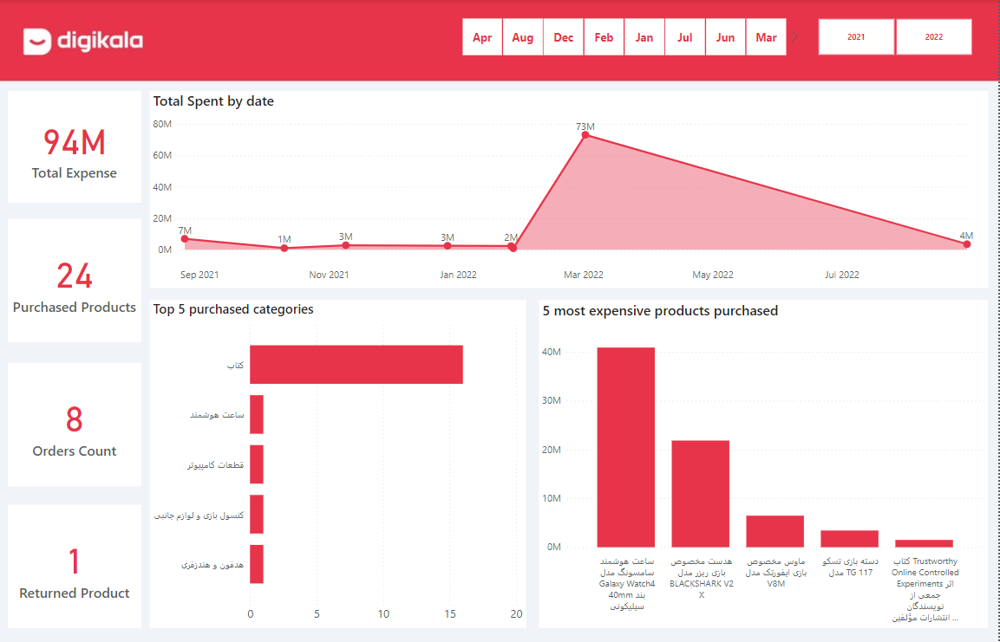

# Digikala Customer Purchase Dashboard

Digikala is an popular Iranian e-commerce company I personally buy a lot from them and in this project I tried to create a dashboard to analyze my purchases.

# Project Overview : 

## 1 - Collecting Data : 
I used Digikala's hidden api to collect data, fortunately Digikala uses api to load data and I didn't have much trouble collecting data (there was no scraping :))

#### What data did I collect ?

- Orders data
   - id
   - payable_price
   - created_at 
   - total_cost
   - shipping_cost 
   - discount

- purchased product data
   - id
   - order_id
   - created_at 
   - title_fa
   - title_en 
   - image_url
   - category

## 2 - Preprocess and Feature engineering collected data : 

 - Convert order date from Jalali to Gregorian
 - Clean category text
 - save datas into csv

## 3 - Creating the dashboard using Power BI

For creating dashboard i used Power BI an powerful tool and interactive data visualization software product developed by Microsoft 

#### What i persented in my dashboard :
**Note: that all the monetary units presented in this dashboard are in Rials**

- Total Expense (Collection of money spent in Digikala)
- Purchased Products (Number of products purchased)
- Orders Count (Number of times ordered)
- Return Products (Number of products purchased and returned)
- Total Spent by date (Total spent by year and month)
- Top 5 purchased categories (Which categories were the most purchased?)
- 5 most expensive products purchased (The most expensive products bought)

## Libraries and software used : 
 
 - [Power BI](https://powerbi.microsoft.com/en/)
 - [requests](https://pypi.org/project/requests/)
 - [pandas](https://pandas.pydata.org/)
 - [persiantools](https://pypi.org/project/persiantools/)
 - [deep-translator](https://pypi.org/project/deep-translator/)  
